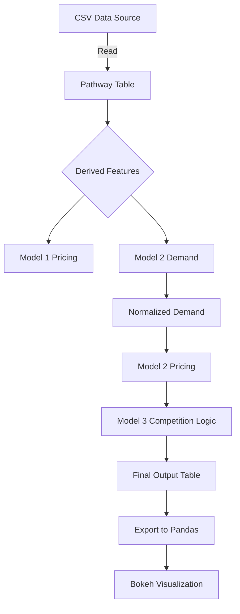

# Summer-Analytics-project : Dynamic Pricing for Urban Parking Lots

This repository contains dynamic pricing modls for urban parking lots.  
It ingests parking lot sensor data, computes demand-based dynamic pricing using multiple models, and generates visualizations comparing pricing strategies.  
The system is designed to simulate both static batch processing and real-time streaming workflows.

## Tech Stack

- Python 3.10+
- Pandas — data cleaning and preprocessing
- Pathway — streaming/batch data pipeline and transformations
- NumPy — numeric computations
- Bokeh — interactive visualizations
- Google Colab / Jupyter Notebook — development environment

 
## Architecture Diagram

## Detailed Project Architecture and Workflow
This system processes and prices parking lot occupancy data in a multi-stage pipeline:

###Data Ingestion
Static Mode (Batch Processing)
  Loads the cleaned dataset (dataset_clean.csv).
  Ensures reproducible outputs for development and testing.

Streaming Mode
  Continuously watches the CSV for new appended rows.
  Automatically recomputes pricing models as new data arrives.

###Feature Engineering

Vehicle Weight
Encodes vehicle impact factor:
  Car = 1.0
  Bike = 0.5
  Truck = 1.5

Occupancy Ratio
  Occupancy Ratio = Occupancy / (Capacity)

Traffic Condition Mapping
  Low = 1
  Medium = 2
  High = 3

Timestamp Parsing
All timestamps are parsed into datetime64 objects to support time-based pricing logic.

### Model 1 — Baseline Dynamic Pricing
Price = Base Price + α × Occupancy Ratio
  Base Price = 10
  α is determined by the time of day:
    Morning Peak (8–10): α = 0.3
    Evening Peak (17–19): α = 0.2
    Off-peak: α = 0.1

### Model 2 — Demand-Based Pricing
Computes a weighted demand score for each parking event:
  Demand = α × OccRatio
       + β × QueueLength
       - γ × TrafficCondition
       + δ × IsSpecialDay
       + ε × VehicleWeight
  α = 1.0, β = 0.5, γ = 0.3, δ = 1.0, ε = 0.7

Normalization:
  NormDemand = (Demand - min) / (max - min)

Price Scaling:
Price = Base × (1 + λ × NormDemand)

where λ depends on the hour:
  Morning Peak: λ = 1.0
  Evening Peak: λ = 0.8
  Off-peak: λ = 0.5

### Model 3 — Competitive Pricing Logic & Rerouting
Adds logical and competitive adjustments:

  Competitor Price Simulation:
    Competitor Price = 12 + (Hour % 4)
  Adjusted Price:
    Adjusted = max(Base × Multiplier, Competitor Price - 1)
  Final Clipped Price:
    Price_Model3 = min(max(Adjusted, 5), 20)
  Reroute Flag Logic:
  If occupancy ≥ capacity and competitor price is cheaper:
    Set RerouteFlag = True
    This can be used to notify users or trigger automatic rerouting.

### Export and Visualization
The final enriched table includes:
  Model 1, 2, 3 prices
  Competitor prices
  Reroute flags
  
All data is exported to a Pandas DataFrame (plot_df) for visualization:
  Model 1 vs Model 2 pricing trends per lot
  Model 3 vs Competitor prices per lot
  Timestamps shown on a time series axis
  Interactive plots created with Bokeh

### Streaming Considerations
In streaming mode:
  .to_pandas() is not used (it will keep waiting for more data).
  Instead, you define sinks:
        pw.io.json.write(
        table,
        destination_path="/tmp/live_prices.jsonl",
        overwrite=True
    )
  This creates a continuously updating output file or stream.
